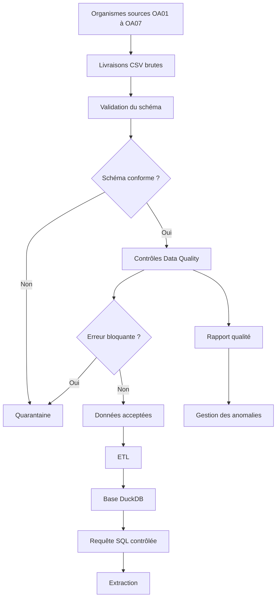

# Belgian Healthcare Claims Data Management Pipeline

<!-- Collez ici le badge GitHub Actions copié depuis GitHub (workflow Python tests). -->

**Validation technique vérifiée :** GitHub Actions — **Success** · pytest — **4/4 tests passed (100 %)**.

Projet de portfolio professionnel consacré à la **gestion de livraisons de données de santé**, au contrôle qualité, aux processus ETL, à la gestion des métadonnées et aux extractions contrôlées à partir de données de remboursement entièrement synthétiques.

Le projet reproduit, à petite échelle, un scénario de Data Management dans lequel plusieurs organismes sources transmettent périodiquement des fichiers qui doivent être contrôlés, documentés, acceptés ou rejetés avant leur intégration dans une base exploitable.

---

## 1. Présentation du projet

L'objectif de ce projet est de démontrer un processus complet de gestion de données de santé :

```
Livraisons de données
        ↓
Contrôle du schéma
        ↓
Contrôle de qualité
        ↓
Acceptation / rejet
     ↙              ↘
Quarantaine      Données validées
                      ↓
                     ETL
                      ↓
                Base DuckDB
                      ↓
            Extraction contrôlée
                      ↓
             Traçabilité / rapport

```

Le projet met volontairement l'accent sur la **fiabilité, la qualité, la documentation et la traçabilité des données**, plutôt que sur la modélisation prédictive ou le machine learning.

---

## 2. Contexte métier simulé

Le scénario repose sur sept organismes assureurs fictifs :

```
OA01
OA02
OA03
OA04
OA05
OA06
OA07

```

Chaque organisme transmet une livraison de données synthétiques de remboursement de soins.

Exemples de fichiers :

```
OA01_2025_01.csv
OA02_2025_01.csv
OA03_2025_01.csv
...
OA07_2025_01.csv

```

Une livraison peut être :

- conforme et acceptée ;
- conforme au schéma mais accompagnée d'avertissements ;
- rejetée en raison d'erreurs de qualité bloquantes ;
- rejetée avant les contrôles métier en raison d'un schéma non conforme.

Le pipeline doit être capable d'identifier ces situations automatiquement.

---

## 3. Avertissement

Ce dépôt est un **projet personnel et indépendant de portfolio** inspiré de problématiques générales de gestion de données de santé.

Il ne constitue pas un projet officiel de l'Agence InterMutualiste / InterMutualistisch Agentschap (AIM/IMA).

Il ne contient :

- aucune donnée AIM/IMA ;
- aucune donnée provenant d'une mutualité belge ;
- aucune donnée administrative confidentielle ;
- aucune donnée réelle concernant des patients.

Toutes les données utilisées dans ce projet sont **entièrement synthétiques** et générées par programmation à des fins de démonstration.

---

## 4. Objectifs

Le projet vise à démontrer les compétences suivantes :

- supervision de livraisons de données ;
- validation de structures de fichiers ;
- formalisation d'un contrat de données ;
- gestion de métadonnées ;
- contrôle automatisé de la qualité ;
- distinction entre anomalies bloquantes et avertissements ;
- gestion de fichiers rejetés ;
- mise en quarantaine des livraisons non conformes ;
- processus ETL reproductible ;
- utilisation de Python et SQL ;
- construction d'une base DuckDB ;
- traduction d'un besoin métier en extraction de données ;
- traçabilité d'une extraction ;
- génération de rapports qualité ;
- documentation de procédures opérationnelles ;
- gestion structurée d'incidents de qualité ;
- tests automatisés.

---

## 5. Les cinq piliers du projet

Le projet est organisé autour de cinq dimensions principales :

### 1. Livraisons

Réception et enregistrement des fichiers transmis par les organismes sources.

### 2. ETL

Extraction, transformation et chargement des données validées.

### 3. Qualité

Application de règles automatiques permettant de détecter les anomalies.

### 4. Métadonnées

Documentation des variables, formats, structures et règles attendues.

### 5. Extractions contrôlées

Transformation d'un besoin métier en requête SQL et production d'un fichier traçable.

---

## 6. Architecture fonctionnelle



## 7. Contrat de données et métadonnées

Le projet utilise un contrat de données permettant de définir notamment :

- le format attendu ;
- l'encodage ;
- le séparateur ;
- les colonnes obligatoires ;
- la clé primaire ;
- la convention de nommage des fichiers ;
- la périodicité des livraisons.

Fichier principal :

```
config/data_contract.yaml

```

Les variables utilisées dans les données synthétiques sont également documentées dans :

```
metadata/data_dictionary.csv

```

Le dictionnaire précise notamment :

- le nom de la variable ;
- son type ;
- sa signification ;
- son caractère obligatoire ou nullable ;
- un exemple de valeur.

---

## 8. Gestion des livraisons

Chaque fichier entrant est évalué avant son intégration dans le système.

Le pipeline distingue notamment les statuts suivants :

```
ACCEPTED
REJECTED_QUALITY
REJECTED_SCHEMA

```

Une livraison présentant uniquement des avertissements peut être conservée.

En revanche, une erreur définie comme bloquante entraîne son rejet.

Cette distinction évite de traiter toutes les anomalies de la même manière.

---

## 9. Cadre de Data Quality

Les contrôles de qualité permettent d'évaluer notamment :

- l'unicité des identifiants ;
- la validité des dates ;
- la cohérence des montants ;
- l'intégrité référentielle ;
- la disponibilité de certaines informations.

Chaque anomalie détectée est enregistrée avec plusieurs attributs :

```
delivery_id
rule_id
severity
claim_id
field
observed_value
expected_value

```

Deux niveaux de sévérité sont utilisés :

### `ERROR`

Anomalie bloquante pouvant conduire au rejet d'une livraison.

### `WARNING`

Anomalie devant être documentée mais ne provoquant pas nécessairement le rejet de la livraison.

---

## 10. Règles ayant réellement déclenché lors de l'exécution

L'exécution documentée du pipeline a déclenché cinq règles de qualité.

| Règle | Sévérité | Anomalie observée | Nombre |
|---|---|---|---:|
| `DQ002` | `ERROR` | Identifiants `claim_id` non uniques | 10 |
| `DQ003` | `ERROR` | Dates de prestation futures | 5 |
| `DQ004` | `ERROR` | Montants de remboursement négatifs | 5 |
| `DQ009` | `ERROR` | Identifiants d'institution inconnus | 5 |
| `DQ010` | `WARNING` | `provider_id` absent | 10 |

Total :

```
35 anomalies
├── 25 ERROR
└── 10 WARNING

```

---

## 11. Résultats réellement obtenus

Les résultats ci-dessous proviennent des fichiers générés par le pipeline.

### Résultat global

| Indicateur | Résultat |
|---|---:|
| Livraisons contrôlées | 7 |
| Livraisons acceptées | 2 |
| Rejets pour qualité | 4 |
| Rejets pour schéma | 1 |
| Anomalies enregistrées | 35 |
| Erreurs bloquantes | 25 |
| Avertissements | 10 |

### Résultat par organisme

| Livraison | Statut | Erreurs bloquantes | Warnings | Explication principale |
|---|---|---:|---:|---|
| `OA01_2025_01` | `ACCEPTED` | 0 | 0 | Livraison conforme |
| `OA02_2025_01` | `ACCEPTED` | 0 | 10 | `provider_id` absent sur 10 enregistrements |
| `OA03_2025_01` | `REJECTED_QUALITY` | 10 | 0 | `claim_id` dupliqués |
| `OA04_2025_01` | `REJECTED_QUALITY` | 5 | 0 | Montants de remboursement négatifs |
| `OA05_2025_01` | `REJECTED_QUALITY` | 5 | 0 | Dates de prestation futures |
| `OA06_2025_01` | `REJECTED_QUALITY` | 5 | 0 | Institution inconnue (`INST999`) |
| `OA07_2025_01` | `REJECTED_SCHEMA` | 1 | 0 | Structure du fichier non conforme |

### Interprétation

Cette exécution démontre notamment qu'une anomalie ne conduit pas automatiquement au rejet d'une livraison.

`OA02` contient dix anomalies `DQ010` classées comme `WARNING`. La livraison reste donc acceptée.

À l'inverse, les anomalies `DQ002`, `DQ003`, `DQ004` et `DQ009` sont considérées comme des erreurs bloquantes et entraînent le rejet des livraisons concernées.

`OA07` est rejetée au niveau du schéma avant son passage dans les contrôles de qualité des enregistrements.

### Validation technique vérifiée

En complément des résultats de Data Quality, le projet a été vérifié par `pytest` dans le workflow GitHub Actions **Python tests**.

| Contrôle technique | Résultat |
|---|---:|
| Tests pytest exécutés | 4 |
| Tests réussis | 4 |
| Tests échoués | 0 |
| Taux de réussite | 100 % |
| GitHub Actions | **Success** |

La dernière exécution vérifiée du job `test` a exécuté `python -m pytest -q` et retourné `4 passed in 0.43s`.

---

## 12. Fichiers de preuve générés

Les résultats du contrôle qualité sont notamment enregistrés dans :

```
outputs/quality_reports/delivery_status.csv
outputs/quality_reports/data_quality_issues.csv
outputs/quality_reports/quality_summary.md

```

### `delivery_status.csv`

Synthétise le statut final de chaque livraison.

### `data_quality_issues.csv`

Contient le détail de chaque anomalie détectée :

- livraison ;
- règle ;
- sévérité ;
- enregistrement ;
- variable concernée ;
- valeur observée ;
- valeur attendue.

### `quality_summary.md`

Produit un résumé automatiquement exploitable des résultats de Data Quality.

Ces fichiers constituent les sources de référence pour documenter les métriques du projet.

---

## 13. Gestion de la quarantaine

Les données non conformes ne sont pas simplement supprimées.

Le pipeline distingue :

```
Données reçues
      ↓
Validation
   ↙       ↘
Échec     Succès
  ↓          ↓
Quarantaine Données acceptées

```

Cette approche permet :

- de conserver la trace de la livraison problématique ;
- d'identifier l'origine de l'anomalie ;
- d'expliquer le rejet ;
- de permettre une correction et une nouvelle livraison ;
- d'éviter l'intégration silencieuse de données incorrectes.

---

## 14. Processus ETL

Le pipeline applique une logique de type :

```
Extract
   ↓
Transform
   ↓
Load

```

### Extract

Lecture des livraisons et des tables de référence.

### Transform

Validation, contrôle de qualité et standardisation.

### Load

Chargement des livraisons acceptées dans la base analytique.

Le pipeline complet est orchestré par :

```
src/run_pipeline.py

```

---

## 15. Base DuckDB

Les données validées sont destinées à être chargées dans une base DuckDB.

Les principaux objets fonctionnels du modèle comprennent notamment :

```
patients
claims
procedures
institutions
deliveries
data_quality_issues

```

Une vue enrichie permet ensuite de réunir les informations nécessaires aux extractions métier.

L'utilisation de DuckDB permet de démontrer conjointement :

- gestion de données tabulaires ;
- SQL ;
- jointures ;
- structuration relationnelle ;
- reproductibilité du pipeline.

---

## 16. Extractions contrôlées

Le projet ne se limite pas à produire une base.

Il simule également une demande métier formalisée.

Exemple :

```
requests/REQ-001.md

```

La demande est traduite en requête SQL :

```
sql/REQ-001.sql

```

puis en extraction :

```
outputs/extracts/REQ-001.csv

```

L'objectif est de démontrer le passage :

```
Besoin métier
     ↓
Spécification
     ↓
Requête SQL
     ↓
Extraction
     ↓
Contrôle
     ↓
Livrable traçable

```

Une métadonnée d'extraction peut également conserver :

- l'identifiant de la demande ;
- la date de génération ;
- le nombre de lignes ;
- la requête utilisée ;
- le fichier produit ;
- son empreinte SHA-256.

---

## 17. Procédures opérationnelles et incidents

Le projet comprend une logique de documentation des procédures opérationnelles.

Exemples :

```
docs/sop/SOP_01_data_delivery.md
docs/sop/SOP_02_data_validation.md
docs/sop/SOP_03_anomaly_management.md
docs/sop/SOP_04_data_extraction.md
docs/sop/SOP_05_release_management.md

```

Un incident de qualité peut être documenté selon la séquence :

```
Incident
   ↓
Détection
   ↓
Impact
   ↓
Décision
   ↓
Action corrective
   ↓
Action préventive

```

Cette approche complète les contrôles techniques par une logique de gestion opérationnelle et de traçabilité.

---

## 18. Tests automatisés

Les règles critiques de qualité sont couvertes par des tests automatisés avec `pytest`.

Pour exécuter les tests :

```bash
python -m pytest -q
```

### Résultat vérifié

Lors de l'exécution automatisée dans GitHub Actions :

```text
....                                             [100%]
4 passed in 0.43s
```

**Résultat : 4/4 tests réussis — 100 %.**

Les tests vérifient notamment :

- qu'un enregistrement valide ne génère aucune anomalie ;
- qu'un montant de remboursement négatif est détecté ;
- qu'un identifiant d'institution inconnu est détecté ;
- qu'un `provider_id` manquant est correctement classé comme `WARNING`.

---

## 19. GitHub Actions

L'intégration continue est configurée avec GitHub Actions afin d'exécuter automatiquement les tests du projet.

Workflow :

```text
.github/workflows/tests.yml
```

### Statut vérifié

```text
Workflow : Python tests
Job      : test
Status   : succeeded
Tests    : 4 passed
Result   : 100 %
```

Les étapes `Set up job`, `Checkout repository`, `Set up Python`, `Upgrade pip`, `Install dependencies` et `Run tests` ont été exécutées avec succès lors de l'exécution vérifiée.

L'étape de test a exécuté :

```bash
python -m pytest -q
```

et a retourné :

```text
....                                             [100%]
4 passed in 0.43s
```

**GitHub Actions : Success.**

Le badge de statut dynamique du workflow peut être placé directement sous le titre principal de ce README afin que l'état courant du workflow soit visible dès l'ouverture du dépôt.

---

## 20. Exécuter le projet

### 1. Cloner le dépôt

```
git clone <URL-DU-DEPOT>
cd belgian-healthcare-claims-data-management

```

### 2. Créer un environnement virtuel

Sous Windows :

```
python -m venv .venv

```

### 3. Activer l'environnement

```
.\.venv\Scripts\Activate.ps1

```

### 4. Installer les dépendances

```
python -m pip install --upgrade pip
python -m pip install -r requirements.txt

```

### 5. Exécuter le pipeline

```
python -m src.run_pipeline

```

### 6. Exécuter les tests

```
python -m pytest -q

```

---

## 21. Compétences démontrées

| Domaine | Mise en œuvre dans le projet |
|---|---|
| Data Management | Gestion du cycle de vie des livraisons |
| Data Quality | Règles automatiques et niveaux de sévérité |
| Metadata Management | Contrat de données et dictionnaire |
| ETL | Pipeline Python reproductible |
| SQL | Extractions et interrogation de DuckDB |
| Database Management | Modèle DuckDB |
| Data Validation | Validation du schéma et des valeurs |
| Referential Integrity | Contrôle des référentiels |
| Incident Management | Documentation des anomalies |
| SOP | Procédures opérationnelles documentées |
| Automation | Pipeline exécutable |
| Testing | 4 tests pytest vérifiés avec succès |
| Version Control | Git et GitHub |
| Continuous Integration | GitHub Actions — Success |
| Traceability | Rapports, statuts et métadonnées d'extraction |

---

## 22. Limites du projet

Ce projet est une démonstration de portfolio.

Il ne cherche pas à reproduire :

- les volumes réels de données administratives de santé ;
- l'architecture informatique interne d'une institution ;
- ses procédures organisationnelles réelles ;
- ses règles métier propriétaires ;
- ses mécanismes réels de pseudonymisation ;
- ses infrastructures de sécurité ou de transfert de données.

Les organismes, patients, prestataires, institutions, codes et montants utilisés dans ce dépôt sont synthétiques.

---

## 23. Principes de reproductibilité

Le projet applique plusieurs principes :

1. les données de démonstration sont générées par programmation ;
2. les règles de qualité sont explicites ;
3. les résultats sont enregistrés dans des fichiers de sortie ;
4. les données rejetées sont séparées des données acceptées ;
5. les transformations sont reproductibles ;
6. les métriques présentées dans le README doivent provenir des fichiers réellement générés.

En particulier, aucune métrique ne doit être ajoutée au README uniquement pour rendre le projet plus impressionnant.

Les résultats documentés doivent rester cohérents avec :

```
outputs/quality_reports/delivery_status.csv
outputs/quality_reports/data_quality_issues.csv
outputs/quality_reports/quality_summary.md

```

---

## 24. Finalité professionnelle

Ce projet vise à montrer la capacité à passer :

```
d'un fichier reçu
       ↓
à une donnée contrôlée
       ↓
à une anomalie explicable
       ↓
à une décision d'acceptation ou de rejet
       ↓
à une base structurée
       ↓
à une extraction documentée et traçable

```

Il constitue ainsi une étude de cas de **Data Management appliqué aux données de santé**, centrée sur la qualité, la structuration, la reproductibilité et la traçabilité.